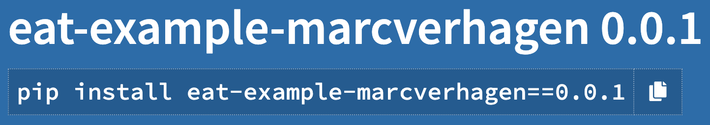
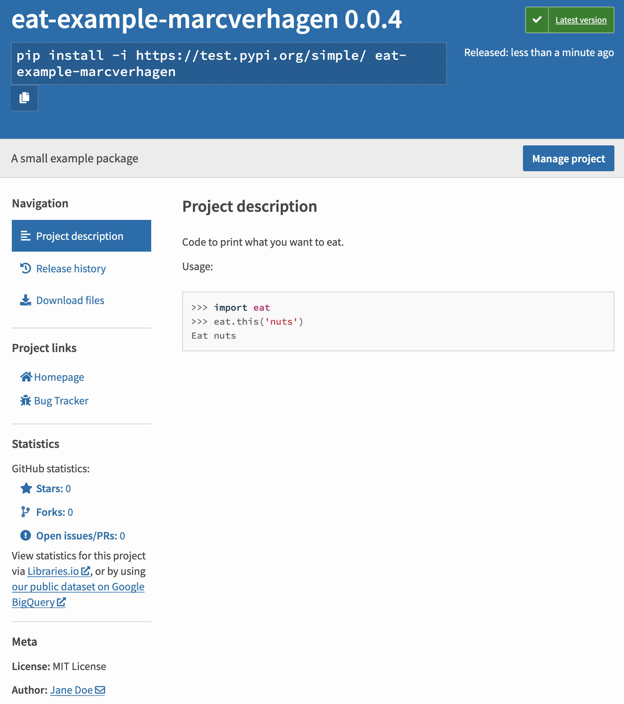

# Python Packaging Tutorial - Part 1

Marc Verhagen, April 2021.

This tutorial takes you through the steps of making code more widely available and focuses on the overal process of packaging and distributing Python code. We start with a very basic python package that has no dependencies on third party packages. And we then first look at how you yourself can use a particular piece of code anywhere on your machine and not just in the same directory as where your code was initially created. This simple process is at the core of more sophisticated approaches like pip install.

From there the tutorial takes you through several steps to make your code easier to use for others, culiminating in a user's ability to do a pip-install and get the code from PyPI, the Python Package Index. Part 2 of this tutorial will work with a more complex example and force us to deal with dependencies, it will also make better use of some of the bells and whistles that PyPI has to offer.

To follow along with the examples you need a recent Python version (probably version 3.6 or higher will do). The examples further assume that we work in a fresh Python environment, that is, nothing else is installed, and we assume that this environment is a virtual environment that lives in `/env/packaging`. In case you don't know what virtual environments are and what they are good for, there are many good places to start reading up on that, including [https://docs.python.org/3/tutorial/venv.html](https://docs.python.org/3/tutorial/venv.html). To set up for this tutorial you should do the following:

```bash
$> python3 -m venv /env/packaging
$> source /env/packaging/bin/activate
(packaging) $>
```

If you do not want to use `/env/packaging` you may save your environment anywhere you want. Note how activating the environment changes your prompt. In all command line examples we include that prompt if you need to be in the environment. With Python examples we assume that Python was started from the `packaging` environment.


## 1. The package

Your first step should be to make sure your code is a package. A Python package is a directory of Python modules that contains an additional `__init__.py` file. The collection of modules can be empty so the package can be just the `__init__.py` file, which is what we do here. See [https://realpython.com/python-modules-packages/](https://realpython.com/python-modules-packages/) for more on packages.

> It is very possible to distribute a single module without creating a package, but when your code is sufficiently complex it is hard if not impossible to support smooth distribution without creating a package. 

We name the package *eat* and it is structured as follows.

```
.
└── eat
    └── __init__.py
```

The `__init__.py` file does nothing except for defining a method that echoes a string to the standard output.

```python
def this(food: str = 'paella') -> str:
    print('Eat', food)
```

Now if you start Python from the directory where the food package lives you can do the following.

```python
>>> import eat
>>> eat.this()
Eat paella
```

This only works when you have your package near at hand. If you need this code from another directory you are out of luck, and of course nobody else can use it. We will improve availability step by step.


## 2. Using your package − simplistic approach

Let's say that our food package lives in `/code/lunch` and that we have another directory `/code/dinner`. To use the food package from the second directory we could just copy it, but that would certainly be a maintenance nightmare. There are two simple ways to make it easier to use your code: (1) changing the search path and (2) adding your package to a standard package directory.

### 2.1. Changing the Python search path

A big improvement over just copying your code is to tell Python where to find the food package by setting or changing the PYTHONPATH environment variable.

```bash
$> cd /code/dinner
$> export PYTHONPATH=/code/lunch
```

The second line above assumes you are in a shell that has the `export` command. In other shells or on Windows you will have to find out how to set environment variables.

If PYTHONPATH was already set (you can check this with `echo $PYTHONPATH`) you can use the following.

```bash
$> export PYTHONPATH="${PYTHONPATH}:/code/lunch"
```

Now you can use anything in `/code/lunch` from Python when you start Python from `/code/dinner` or from any other directory.

```python
>>> import eat
>>> eat.this()
Eat paella
```

Under the hood, setting this environment variable will update the value of the Python  `sys.path` variable, which you could also choose to do from within Python by directly appending to `sys.path`, but it is generally better to not burden your Python code with this.

In any case, updating the environment variable gives you access to a package from anywhere on your machine. But you would have to do this for any package you want to make available, unless you create all your code on the same spot.

### 2.2. Using the standard package location	

Another option is to put a copy of your code at a standard location that is already used for packages so you can use your code without changing the path. This is actually part of what pip install does so it is instructive to look at the specifics.

> Manually installing packages is in general not the best way to install packages and you should really use pip install, we only do this here  to show the basics behind installing packages.

Within your virtual environment there is a directory `lib/python3.7/site-packages` and that directory  is the standard space for Python packages. Just after creating the virtual environment the only two packages installed there are `pip` and `setuptools`.  We assumed that our `food` package lives in `/code/lunch` and we can install the package as follows.

```bash
$> cp -r /code/lunch/food /env/packaging/lib/python3.7/site-packages
```

And now you can access the food packages from anywhere, as long as you use your virtual environment.

```bash
$> mkdir new-directory
$> cd new-directory
$> source /env/packaging/bin/activate
(packaging) $> python
```

```python
>>> import eat
>>> eat.this()
Eat paella
```

### 2.3. Distributing the package

With this approach it is easy to give your code to others. You wrap up your package in a zip archive and put it some place where others can dowload it, and they unpack the archive somehwere and then either update the Python path or copy the package to `site-packages`.

However, all the drawbacks mentioned above remain so we will now look at a more sophisticated way to build a package, one where you can save metadata with the package and where people can install your code using pip.


## 3. Building a pip-installable package

There are some drawbacks to the approaches above. In general, they have a somewhat haphard feel to them. There is no accounting of anything and you will also have to manually keep track of where your packages are what version you are using. Being able to install a package with pip will structure your package life an dmake it easier for others to know what they have in a newly gotten package.

Much of this section is based on existing tutorials, including the official [packaging tutorial](https://packaging.python.org/) from PyPA, the Python Packaging Authority ([https://www.pypa.io/en/latest/](https://www.pypa.io/en/latest/)), a working group that maintains many of the projects related to Python packaging. PyPI is the default Package Index for the Python community which lives at [https://pypi.org/](https://pypi.org/).

To be able to build and upload a pip-installable package you need to install the `build` and `twine` packages.

```bash
(packaging) $> pip install --upgrade build twine
```

The latter is for uploading to PyPI.

### 3.1. Configuration

In order to create a distributable package we need to add some configuration files to our Python package. This simple example is in this repository in the `example1` directory.

```
.
├── eat
│   └── __init__.py
├── pyproject.toml
└── setup.cfg
```

The file `pyproject.toml` is a [TOML](https://en.wikipedia.org/wiki/TOML) configuration file that tells build tools what system you are using and what is required for building. The following boilerplate is suggested.

```toml
[build-system]
requires = ["setuptools>=42", "wheel"]
build-backend = "setuptools.build_meta"
```

I have found it will still work without requiring "wheel" and without including the third line, but this may be because of the simple example. The packages listed here will *only* be available during the build, not after they are installed.

The `setup.cfg` file is configuration file intended to capture static metadata for your package. Not sure what exact format it is in (cfg files can be in many formats) but it does look like another TOML file. Here is the configuration for our simple package.

```properties
[metadata]
name = eat-example-marcverhagen
version = 0.0.1

[options]
packages = find:
```

All that is needed are

1. The name for the package. This should be a name that is unique on PyPI, usually adding your account name will take care of that, but when you actually put something up there that you want people to use you may want to look for a better name.
2. A version number. You can actually do without, but then your version number will be `0.0.0`.
3. An indication of where the build process will find your Python packages. The simplest option is to use the `find:` directive, which instructs the build process to look for any package in the current directory, which is where the `eat` package lives.

### 3.2. Building and installing

Now we can run the build process and build a distribution. Run this from the `eat` directory.

```bash
(packaging) $> python -m build
```

This prints a lot of notes to the terminal and adds build files, distribution files and meta data files to the directry and at the end the directory tree is as follows.

```
.
├── build
│   ├── bdist.macosx-10.11-x86_64
│   └── lib
│       └── eat
│           └── __init__.py
├── dist
│   ├── eat-example-marcverhagen-0.0.1.tar.gz
│   └── eat_example_marcverhagen-0.0.1-py3-none-any.whl
├── eat
│   └── __init__.py
├── eat_example_marcverhagen.egg-info
│   ├── PKG-INFO
│   ├── SOURCES.txt
│   ├── dependency_links.txt
│   └── top_level.txt
├── pyproject.toml
└── setup.cfg
```

During this process you will see a few warnings, including the following.

```
warning: sdist: standard file not found: should have one of README, README.rst, README.txt, README.md
warning: check: missing required meta-data: url
warning: check: missing meta-data: either (author and author_email) or (maintainer and maintainer_email) must be supplied
```

None of these break the build so it is fine to ignore them, but in a later section we will add some other files and metadata, which will take care of these warnings.

After the build you have two archives in `dist` which both contain the actual code and some metadata. You can use either of them to install the package with pip.

```bash
(packaging) $> pip install dist/eat-example-marcverhagen-0.0.1.tar.gz
```

```bash
(packaging) $> pip install dist/eat_example_marcverhagen-0.0.1-py3-none-any.whl
```

This second one uses a Python wheel file, which generally makes for a much faster installation. In both cases, after installation you have two new directories in your virtual environment directory tree.

```
lib/python3.8/site-packages/eat/
lib/python3.8/site-packages/eat_example_marcverhagen-0.0.1.dist-info/
```

The first is the package, which for this simple example will just have the `__init__.py` file, the second has some metadata information for pip. If you remove the dist-info directory pip will not know that the `eat` package is installed nor will it know how to uninstall it.

Now you can access the code form anywhere as long as you start Python from your the same environment as you did the pip-install in.

```python
>>> import eat
>>> eat.this()
Eat paella
```

Note how the distributed package is named `eat-example-marcverhagen`, but that the actual Python module that you import is named `eat`. The former is defined in the configuration file while the latter is defined by what Python packages are found in the top-level directory.

You can make these archives available to the world and anyone can then do their own local install.

### 3.3. Uploading to PyPI

For maximum usability and comfort to users you may consider putting your code on [pypi.org/](https://pypi.org/), which makes installation of your code a one-command affair. Putting stuff on PyPI is somewhat tricky, luckily there is also a test platform at [https://test.pypi.org/](https://test.pypi.org/) which allows you to test your package before you make it available for real. It is easy to get an account and password for both these sites, but it is suggested that you also get an API token to authenticate. For the test platform you get a token at [https://test.pypi.org/manage/account/](https://test.pypi.org/manage/account/), see [https://test.pypi.org/help/#apitoken](https://test.pypi.org/help/#apitoken) for help. For the main PyPI you start at [https://pypi.org/manage/account/](https://pypi.org/manage/account/)

Once you have an account you can use `twine` to upload your package.

```bash
(package) $> twine upload --repository testpypi dist/*
Uploading distributions to https://test.pypi.org/legacy/
Enter your username: __token__
Enter your password:
Uploading eat_example_marcverhagen-0.0.1-py3-none-any.whl
100%|████████████████████████████████████████| 5.80k/5.80k [00:01<00:00, 5.51kB/s]
Uploading eat_example-marcverhagen-0.0.1.tar.gz
100%|████████████████████████████████████████| 4.91k/4.91k [00:00<00:00, 6.19kB/s]

View at:
https://test.pypi.org/project/eat-example-marcverhagen/0.0.1/
```

Here we used `__token__` and the actual token to log in, you could have used your user name and password. After this the package is indeed viewable at the above URL, which prominently lists a command that anyone can use to install your package.

```bash
$> pip install -i https://test.pypi.org/simple/ eat-example-marcverhagen
```

The `-i` option makes sure pip does not search the default location on  [pypi.org](https://pypi.org/). When your run the command above you will get something like this. 

```bash
Looking in indexes: https://test.pypi.org/simple/
Collecting eat-example-marcverhagen
  Downloading https://test-files.pythonhosted.org/packages/4a/36/75a70eeee3fe345a6abc4e6273d0006725b9cacf98bb5fcb59a7e7cd680e/eat_example_marcverhagen-0.0.1-py3-none-any.whl (1.4 kB)
Installing collected packages: eat-example-marcverhagen
Successfully installed eat-example-marcverhagen-0.0.1
```

When you look into your environment you will once again see the following two directories added to the site packages.

```
lib/python3.8/site-packages/eat/
lib/python3.8/site-packages/eat_example_marcverhagen-0.0.1.dist-info/
```

You can now check whether you are satisfied with the workings of your package and check whether you are satisfied with the page at [https://test.pypi.org/project/eat-example-marcverhagen/0.0.1/](https://test.pypi.org/project/eat-example-marcverhagen/0.0.1/). If so, you can upload your package to PyPI in pretty much the same way as for the test platform.

```bash
(packaging) $> twine upload --repository pypi dist/*
Uploading distributions to https://upload.pypi.org/legacy/
Enter your username: marcverhagen
Enter your password: 
Uploading eat_example_marcverhagen-0.0.1-py3-none-any.whl
100%|████████████████████████████████████████████| 3.93k/3.93k [00:01<00:00, 2.41kB/s]
Uploading eat-example-marcverhagen-0.0.1.tar.gz
100%|████████████████████████████████████████████| 3.63k/3.63k [00:00<00:00, 4.56kB/s]

View at:
https://pypi.org/project/eat-example-marcverhagen/0.0.1/
```

Here is a fragment of the page advertized immediately above.



You can have multiple versions up there which you can see via the "Release history" link.

And now you can do an install without the `-i` option.

```bash
$> pip install eat-example-marcverhagen
Requirement already satisfied: eat-example-marcverhagen in /Applications/ADDED/venv/packaging/lib/python3.8/site-packages (0.0.1)
```

Since the package was already installed nothing happens.


## 4. Bells and whistles

The previous section just had the simplest possible way to build, upload and install a package. This section lists a few improvements. Code for all this is in `example2` in this repository.

### 4.1. Putting all code in a subdirectory

In less trivial cases it is common to have the Python packages not at the same level as the configuration files but in a sub directory, often called `src`.

```
.
├── pyproject.toml
├── setup.cfg
└── src
    └── eat
        └── __init__.py
```

In this case we need to change the `setup.cfg` configuration file because with the old configuration the build process looks for packages directly inside of the top-level directory. And since `src` is not a package (and it probably shouldn't be) the process will fail to find any packages. Unfortunately, it will still happily build along and you won't know there is a failure till you realize that the archives you created do not have any package code in them. So we amend the configuration file a bit.

```properties
[metadata]
name = eat-example-marcverhagen
version = 0.0.2

[options]
package_dir = 
    = src
packages = find:

[options.packages.find]
where = src
```

We have upped the version to 0.0.2. The `[options]` section looks somewhat funky. What you should realize is that the value of `package_dir` is a mapping of package names to directories and that all elements of the mapping are indented. The line just below `package_dir =` indicates that the root package, represented by the empty string, can be found in the `src` directory. The `find:` directive means that all package will be automatically discovered and `where = src` determines where discovery starts off. You need all the lines that were added here, if you leave some out you either get an error or again end up with an empty package.

### 4.2. Adding more data

We will add a license and a readme file and some meta data for the package. Here is the expanded directory structure.

```
.
├── LICENSE
├── README.md
├── pyproject.toml
├── setup.cfg
└── src
    └── eat
        └── __init__.py
```

The `LICENSE` file contains the MIT license and `README.md` has a few usage notes.

For metadata we now have:

```properties
[metadata]
name = eat-example-marcverhagen
version = 0.0.2
author = Jane Doe
author_email = jane@example.com
description = A small example package
long_description = file: README.md
long_description_content_type = text/markdown
url = https://github.com/marcverhagen/packaging-tutorial-part1
project_urls =
    Bug Tracker = https://github.com/marcverhagen/packaging-tutorial-part1/issues
classifiers =
    Programming Language :: Python :: 3
    Programming Language :: Python :: 3.6
    Programming Language :: Python :: 3.7
    Programming Language :: Python :: 3.8
    License :: OSI Approved :: MIT License
    Operating System :: OS Independent
```

The urls would usually go to the Github repository for your code, here they point to this tutorial because the code is embedded in it. The `file:` directive will use the contents of the specified file for the long description and `long_description_content_type` has the MIME type for that file.

### 4.3. Using setup.py and using a manifest

The `setup.cfg` file is configuration file intended to capture static metadata for your package. But you can also use a configuration file named `setup.py`. The official tutorial strongly suggests that all static data go in  `setup.cfg`  and to use `setup.py` only if you have to. What you put in `setup.cfg` will be default values which can be overruled by `setup.py`. The latter has the advantage that you can put in some programming logic, like extracting the version from a `VERSION` file, but it is a good idea to keep that logic simple. We have had no need for `setup.py`, but we can still add it for potential later use and if you do include it it needs the following minimal content.

```python
import setuptools
setuptools.setup()
```

Let's come up with a use case for putting something in the configuration that cannot go in `setup.cfg` and at the same time introduce the notion of the manifest. Say we want to add a version file named `VERSION` to the `eat` package and read the version from that file instead of setting it in `setup.cfg`. And say we also want to keep that version file in distributed package.

By default, when the build script looks for data in the Python package in `src` it only gets python scripts, other files are ignored. You can use a manifest to stipulate precisely what you want included in the build. To do that you add a file `MANIFEST.in` with the following content.

```
include src/eat/VERSION
```

At the same time we change `setup.py` as fso that it reads the version number from .

```python
import setuptools
setuptools.setup(
  version=open('src/eat/VERSION').read().strip()
)
```

With these changes we now have the following directory structure.

```
.
├── LICENSE
├── MANIFEST.in
├── Makefile
├── README.md
├── pyproject.toml
├── setup.cfg
├── setup.py
└── src
    └── eat
        ├── VERSION
        └── __init__.py
```

### 4.4. Uploading the bells and whistles

We can build a new version and upload it to the test PyPI.

```bash
(packaging) $> python -m build
(packaging) $> twine upload --repository testpypi dist/*
```

This version will have more meta data and the version file will be included and the version number in that file will overrule the number in `setup.cfg` in case it is still in there.

It should be noted that you can upload multiple versions, just keep incrementing the version number in the configuration file. On both PyPI and the test platform you have the option to delete a version. However, you cannot then upload the just deleted version again and when you try that you can get a "File already exists" error ([https://test.pypi.org/help/#file-name-reuse](https://test.pypi.org/help/#file-name-reuse)). PyPI does not allow for a filename to be reused, even once a project has been deleted and recreated. This is somewhat annoying but it makes sense when you think about it. Users will rely on a particular version of your software to always be the same, but they cannot rely on that if you have the ability to change a version.

To avoid this situation, first use Test PyPI to perform and check your upload first, you may have to create many versions (0.0.1, 0.0.2, 0.0.3, 0.0.4 etcetera) and some or many of them you may throw away. But you can keep a cleaner version history on [pypi.org](https://pypi.org/) if you only upload only those versions that behave as expected.

On the test PyPI site you can now see the metadata.



And anyone with access to pip can install your package.

```bash
$> pip install -i https://test.pypi.org/simple/ eat-example-marcverhagen
```

