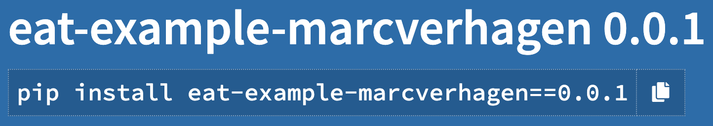
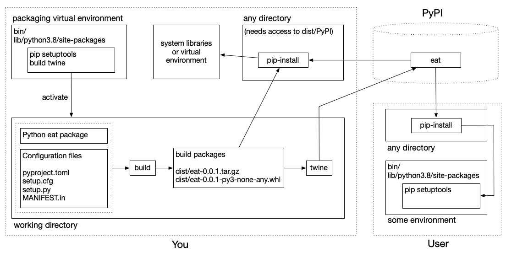

# Python Packaging Tutorial - Basics

Last updated, May 2024.

This tutorial takes you through the steps of making your code more widely available and focuses on the overal process of packaging and distributing Python code. We start with a very basic python package that has no dependencies on third party packages. And we then first look at how you yourself can use a particular piece of code anywhere on your machine and not just in the same directory as where your code was initially created. This simple process is at the core of more sophisticated approaches like pip install.

From there the tutorial takes you through several steps to make your code easier to use for others, culminating in a user's ability to do a pip-install and get the code from PyPI, the Python Package Index. Part 2 of this tutorial (to be released, at some point) will work with a more complex example and force us to deal with dependencies, it will also make better use of some of the bells and whistles that PyPI has to offer.

To follow along with the examples you need a recent Python version (probably version 3.8 or higher will do). The examples further assume that we work in a fresh Python environment, that is, nothing else is installed, and we assume that this environment is a virtual environment that lives in `/env/packaging`. In case you don't know what virtual environments are and what they are good for, there are many good places to start reading up on that, including [https://docs.python.org/3/tutorial/venv.html](https://docs.python.org/3/tutorial/venv.html). To set up for this tutorial you should do the following:

```bash
$ python3 -m venv /env/packaging
$ source /env/packaging/bin/activate
(packaging) $
```

If you do not want to use `/env/packaging` you may save your environment anywhere you want. Note how activating the environment changes your prompt. In all command line examples we include that prompt if you need to be in the environment. With Python examples we assume that Python was started from the `packaging` environment.


## 1. The package

Your first step is to make sure your code is a package. A Python package is a directory of Python modules that contains an additional `__init__.py` file. The collection of modules can be empty so the package can be just the `__init__.py` file, which is what we do here. See [https://realpython.com/python-modules-packages/](https://realpython.com/python-modules-packages/) for more on packages.

> It is possible to distribute a single module without creating a package, but when your code is sufficiently complex it is hard to support smooth distribution without creating a package. 

We name the package *eat* and it is structured as follows.

```
.
└── eat
    └── __init__.py
```

The `__init__.py` file does nothing except for defining a method that echoes a string to the standard output.

```python
def this(food: str = 'paella') -> str:
    print('Eat', food)
```

Now if you start Python from the directory where the eat package lives you can do the following.

```python
>>> import eat
>>> eat.this()
Eat paella
```

This only works when you have your package near at hand. If you need this code from another directory you are out of luck, and of course nobody else can use it. We will improve availability step by step.


## 2. Using your package elsewhere − simplistic approach

Let's say that our eat package lives in `/code/lunch` and that we have another directory `/code/dinner`. To use the eat package from the second directory we could just copy it, but that is a maintenance nightmare. There are two simple ways to make it easier to use your code: (1) changing the search path and (2) adding your package to a standard package directory.

### 2.1. Changing the Python search path

A big improvement over just copying your code is to tell Python where to find the eat package by setting or changing the PYTHONPATH environment variable.

```bash
$ export PYTHONPATH=/code/lunch
```

This assumes you are in a shell that has the `export` command. In other shells or on Windows you will have to find out how to set environment variables. If PYTHONPATH was already set (check this with `echo $PYTHONPATH`) you can use the following.

```bash
$ export PYTHONPATH="${PYTHONPATH}:/code/lunch"
```

Now you can use anything in `/code/lunch` from Python when you start Python from any other directory.

```bash
$ cd /code/dinner
$ python

```

```python
>>> import eat
>>> eat.this()
Eat paella
```

Under the hood, setting this environment variable will update the value of the Python  `sys.path` variable, which you could also choose to do from within Python by directly appending to `sys.path`, but it is generally better to not burden your Python code with this.

In any case, updating the environment variable gives you access to a package from anywhere on your machine. But you would have to do this for any package you want to make available, unless you create all your code on the same spot.


### 2.2. Using the standard package location

Another option is to put a copy of your code at a standard location that is already used for packages so you can use your code without changing the path. This is actually part of what pip install does so it is instructive to look at the specifics.

> Manually installing packages is in general not the best way to install packages and you should really use pip install, we only do this here to show the basics behind installing packages.

Within your virtual environment there is a directory `lib/python3.7/site-packages` and that directory  is the standard space for Python packages. Just after creating the virtual environment the only two packages installed there are `pip` and `setuptools`.  We assumed that our `eat` package lives in `/code/lunch` and we can install the package as follows.

```bash
$ cp -r /code/lunch/eat /env/packaging/lib/python3.7/site-packages
```

And now you can access the food packages from anywhere, as long as you use your virtual environment.

```bash
$ mkdir new-directory
$ cd new-directory
$ source /env/packaging/bin/activate
(packaging) $ python
```

```python
>>> import eat
>>> eat.this()
Eat paella
```

### 2.3. Distributing the package

It is now easy to give your code to others. You wrap up your package in an archive, add some notes  on what requirements your package has and put it at some web-accessable place. Anyone can dowload it, unpack the archive and then either update the Python path or copy the package to `site-packages`.

We will now look at a more sophisticated way to build a package, one where you can save metadata with the package and where people can install your code using pip.


## 3. Building a pip-installable package

There are drawbacks to the approach above. There is no accounting of anything and you will have to manually keep track of where your packages are and what version you are using. And the standard pip package manager will not know that your package is in the `site-packages` folder. Installing with pip takes care of the missing bookkeeping.

Much of this section is based on existing tutorials, including the official [packaging tutorial](https://packaging.python.org/) from PyPA, the [Python Packaging Authority](https://www.pypa.io/en/latest/), a working group that maintains many of the projects related to Python packaging. PyPI at [https://pypi.org/](https://pypi.org/) is the default Package Index for the Python community.

To be able to build and upload a pip-installable package you need to install the `build` and `twine` packages.

```bash
(packaging) $ pip install --upgrade build twine
```

The latter is for uploading to PyPI.

### 3.1. Configuration

In order to create a distributable package we need to add some configuration files to our Python package. This simple example is in this repository in the `` directory.

```
.
├── eat
│   └── __init__.py
├── pyproject.toml
└── setup.cfg
```

The file `pyproject.toml` is a [TOML](https://en.wikipedia.org/wiki/TOML) configuration file that tells build tools what system you are using and what is required for building. The following boilerplate is suggested.

```toml
[build-system]
requires = ["setuptools>=42", "wheel"]
build-backend = "setuptools.build_meta"
```

I have found that the current example will still work without requiring "wheel" and without including the third line, but this may be because of the simplicity of the example. The packages listed here will *only* be needed during the build, they are not needed by the installled packages.

The `setup.cfg` file is configuration file intended to capture static metadata for your package. Not sure what exact format it is in (cfg files can be in many formats) but it does look like another TOML file. Here is the configuration for our simple package.

```properties
[metadata]
name = eat-example-marcverhagen
version = 0.0.1

[options]
packages = find:
```

All that is needed are

1. The name for the package. This should be a name that is unique on PyPI, usually adding your account name will take care of that, but when you actually put something up there that you want people to use you may want to look for a better name. I find it useful to have the name start with the name of the Python package that you would import in your code.
2. A version number. You can do without, but then your version number will be `0.0.0`.
3. An indication of where the build process will find your Python packages. The simplest option is to use the `find:` directive, which instructs the build process to look for any package in the current directory, which is where the `eat` package lives.

### 3.2. Building and installing

Now we can run the build process and build a distribution. Run this from the `part1-basics/code` directory, which also includes the *eat* package.

```bash
(packaging) $ python -m build
```

This prints a lot of notes to the terminal and adds build files, distribution files and meta data files to the current directory, and at the end of the build process the directory tree is as follows.

```
.
├── build
│   ├── bdist.macosx-10.11-x86_64
│   └── lib
│       └── eat
│           └── __init__.py
├── dist
│   ├── eat-example-marcverhagen-0.0.1.tar.gz
│   └── eat_example_marcverhagen-0.0.1-py3-none-any.whl
├── eat
│   └── __init__.py
├── eat_example_marcverhagen.egg-info
│   ├── PKG-INFO
│   ├── SOURCES.txt
│   ├── dependency_links.txt
│   └── top_level.txt
├── pyproject.toml
└── setup.cfg
```

Depending on the Python version and the version of the build code the `build` directory may not be there. If it is, it is safe to delete it. Also depending on code versions, during this process you may see a few warnings, including the following.

```
warning: sdist: standard file not found: should have one of README, README.rst, README.txt, README.md
warning: check: missing required meta-data: url
warning: check: missing meta-data: either (author and author_email) or (maintainer and maintainer_email) must be supplied
```

None of these break the build so it is fine to ignore them, but in a later section we will add some other files and metadata, which will take care of these warnings.

After the build you have two archives in `dist` which both contain the actual code and some metadata. You can use either of them to install the package with pip.

```bash
(packaging) $ pip install dist/eat-example-marcverhagen-0.0.1.tar.gz
```

```bash
(packaging) $ pip install dist/eat_example_marcverhagen-0.0.1-py3-none-any.whl
```

This second one uses a Python wheel file, which generally makes for a much faster installation. In both cases, after installation you have two new directories in your virtual environment directory tree.

```
lib/python3.8/site-packages/eat/
lib/python3.8/site-packages/eat_example_marcverhagen-0.0.1.dist-info/
```

The first is the package, which for this simple example will just have the `__init__.py` file, the second has some metadata information for pip. If you remove the dist-info directory pip will not know that the `eat` package is installed nor will it know how to uninstall it.

Now you can access the code from anywhere as long as you start Python from your the same environment as you did the pip-install in.

```python
>>> import eat
>>> eat.this()
Eat paella
```

Note how the distributed package is named `eat-example-marcverhagen`, but that the actual Python package that you import is named `eat`. The former is defined in the configuration file while the latter is defined by what Python packages are found in the top-level directory.

> It is a good idea to not use names of popular packages. Pip has the nasty habit of overwriting files that were put there by other installs without warnings. For example, I tried renaming the `eat` directory into `zeep` and then build the package and install it in another environment that already had zeep in it. This replaced the init file from the zeep installation with the one in my eat package. I may be missing something here but that is just not right. This [issue](https://github.com/pypa/pip/issues/4625) seems relevant, it includes the statement "the name clash pretty much is the fault of the package authors ^^ pip cant help bad packagers and pypi is not curated". I cannot get myself to agree with that.

Anyway, you can now make these archives available to the world and anyone can then do their own local pip install.


### 3.3. Uploading to PyPI

For maximum usability and comfort to users you may consider putting your code on [pypi.org/](https://pypi.org/), which makes installation of your code a one-command affair. Putting stuff on PyPI is somewhat tricky, luckily there is also a test platform at [https://test.pypi.org/](https://test.pypi.org/) which allows you to test your package before you make it available for real. It is easy to get an account and password for both these sites, but it is suggested that you also get an API token to authenticate. For the test platform you get a token at [https://test.pypi.org/manage/account/](https://test.pypi.org/manage/account/), see [https://test.pypi.org/help/#apitoken](https://test.pypi.org/help/#apitoken) for help. For the main PyPI you start at [https://pypi.org/manage/account/](https://pypi.org/manage/account/)

Once you have an account you can use `twine` to upload your package.

```bash
(package) $ twine upload --repository testpypi dist/*
Uploading distributions to https://test.pypi.org/legacy/
Enter your username: __token__
Enter your password:
Uploading eat_example_marcverhagen-0.0.1-py3-none-any.whl
100%|████████████████████████████████████████| 5.80k/5.80k [00:01<00:00, 5.51kB/s]
Uploading eat_example-marcverhagen-0.0.1.tar.gz
100%|████████████████████████████████████████| 4.91k/4.91k [00:00<00:00, 6.19kB/s]

View at:
https://test.pypi.org/project/eat-example-marcverhagen/0.0.1/
```

Here we used `__token__` and the actual token to log in, you could have used your user name and password. After this the package is indeed viewable at the above URL, which prominently lists a command that anyone can use to install your package.

```bash
$ pip install -i https://test.pypi.org/simple/ eat-example-marcverhagen
```

The `-i` option makes sure pip does not search the default location on  [pypi.org](https://pypi.org/). When you run the command above you will get something like this. 

```bash
Looking in indexes: https://test.pypi.org/simple/
Collecting eat-example-marcverhagen
  Downloading https://test-files.pythonhosted.org/packages/4a/36/75a70eeee3fe345a6abc4e6273d0006725b9cacf98bb5fcb59a7e7cd680e/eat_example_marcverhagen-0.0.1-py3-none-any.whl (1.4 kB)
Installing collected packages: eat-example-marcverhagen
Successfully installed eat-example-marcverhagen-0.0.1
```

When you look into your environment you will once again see the following two directories added to the site packages.

```
lib/python3.8/site-packages/eat/
lib/python3.8/site-packages/eat_example_marcverhagen-0.0.1.dist-info/
```

You can now check whether you are satisfied with the workings of your package and check whether you are satisfied with the page at [https://test.pypi.org/project/eat-example-marcverhagen/0.0.1/](https://test.pypi.org/project/eat-example-marcverhagen/0.0.1/). If so, you can upload your package to PyPI in pretty much the same way as for the test platform.

```bash
(packaging) $> twine upload --repository pypi dist/*
Uploading distributions to https://upload.pypi.org/legacy/
Enter your username: marcverhagen
Enter your password: 
Uploading eat_example_marcverhagen-0.0.1-py3-none-any.whl
100%|████████████████████████████████████████████| 3.93k/3.93k [00:01<00:00, 2.41kB/s]
Uploading eat-example-marcverhagen-0.0.1.tar.gz
100%|████████████████████████████████████████████| 3.63k/3.63k [00:00<00:00, 4.56kB/s]

View at:
https://pypi.org/project/eat-example-marcverhagen/0.0.1/
```

Here is a fragment of the page advertized immediately above.



You can have multiple versions up there which you can see via the "Release history" link.

And now you can do an install without the `-i` option.

```bash
$ pip install eat-example-marcverhagen
Requirement already satisfied: eat-example-marcverhagen in /Applications/ADDED/venv/packaging/lib/python3.8/site-packages (0.0.1)
```

Since the package was already installed nothing happens.

All the above steps can be schematized as follows.


