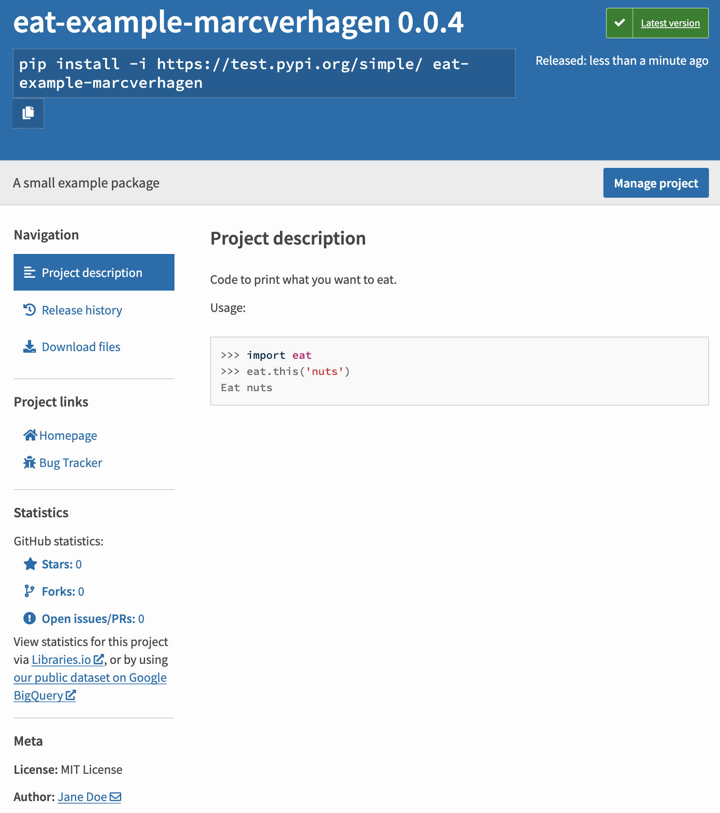

# Python Packaging Tutorial - Bells and Whistles

Last updated, May 2023.

The previous tutorial in this repository (see its [README](../part1-basics/README.md) file) showed the simplest possible way to build, upload and install a package. This section lists a few improvements:

1. Using a more standard directory structure
2. Adding extra metadata
3. Using setup.py and a manifest

Code for all this is in `part2-bells-and-whistles/code` in this repository.


## 1. Putting all code in a subdirectory

In less trivial cases it is common to have the Python packages not at the same level as the configuration files but in a sub directory, often called `src`.

```
.
├── pyproject.toml
├── setup.cfg
└── src
    └── eat
        └── __init__.py
```

With this we should change the `setup.cfg` configuration file because with the old configuration the build process looks for packages directly inside of the top-level directory. And since `src` is not a package itself the process will fail to find any packages. Unfortunately, it will still happily build along and you won't know there is a failure till you realize that the archives you created do not have any package code in them. To avoid that we amend the configuration file a bit.

```properties
[metadata]
name = eat-example-marcverhagen
version = 0.0.2

[options]
package_dir = 
    = src
packages = find:

[options.packages.find]
where = src
```

We have upped the version to 0.0.2. The options section looks somewhat funky. What you should realize is that the value of `package_dir` is a mapping of package names to directories and that all elements of the mapping are indented. The line `    = src` is actually short for `    "" = src`  and indicates that the root package, represented by the empty string, can be found in the `src` directory. The `find:` directive again means that all packages will be automatically discovered and `where = src` determines where discovery starts off. You need all the lines that were added here, if you leave some out you either get an error or again end up with an empty package.


## 2. Adding more data

We will add a license and a readme file and some meta data for the package. Here is the expanded directory structure.

```
.
├── LICENSE
├── README.md
├── pyproject.toml
├── setup.cfg
└── src
    └── eat
        └── __init__.py
```

The `LICENSE` file contains the MIT license and `README.md` has a few usage notes. Both will be bundled in the package, the 

For metadata we now have:

```properties
[metadata]
name = eat-example-marcverhagen
version = 0.0.2
author = Jane Doe
author_email = jane@example.com
description = A small example package
long_description = file: README.md
long_description_content_type = text/markdown
url = https://github.com/marcverhagen/packaging-tutorial
project_urls =
    Bug Tracker = https://github.com/marcverhagen/packaging-tutorial/issues
classifiers =
    Programming Language :: Python :: 3
    Programming Language :: Python :: 3.8
    Programming Language :: Python :: 3.9
    Programming Language :: Python :: 3.10
    Programming Language :: Python :: 3.11
    License :: OSI Approved :: MIT License
    Operating System :: OS Independent
```

The URL points to the GitHub repository that this tutorial is in, but it often points to a more specific site or to GitHub pages. The `file:` directive uses the contents of the specified file for the long description and `long_description_content_type` has the MIME type for that file.


## 3. Using setup.py and a manifest

The `setup.cfg` file is a configuration file intended to capture static metadata for your package. But you can also use a configuration file named `setup.py`. The official tutorial strongly suggests that all static data go in `setup.cfg` and to use `setup.py` only if you have to. What you put in `setup.cfg` will be default values which can be overruled by `setup.py`. The latter has the advantage that you can put in some programming logic, like extracting the version from a `VERSION` file, but it is a good idea to keep that logic simple. So far we have had no need for `setup.py`, but we can still add it for potential later use (as in a few lines below) and if you do include it it needs the following minimal content.

```python
import setuptools
setuptools.setup()
```

Let's come up with a use case for putting something in the configuration that cannot go in `setup.cfg` and at the same time introduce the notion of the manifest. Say we want to add a version file named `VERSION` to the `eat` package and read the version from that file instead of setting it in `setup.cfg`. And say we also want to keep that version file in the distributed package.

By default, when the build script looks for data in the Python package in `src` it only gets python scripts, other files are ignored. You can use a manifest to stipulate precisely what you want included in the build. To do that you add a file `MANIFEST.in` with the following content.

```
include src/eat/VERSION
```

At the same time we change `setup.py` so that it reads the version number from a file.

```python
import setuptools
setuptools.setup(
  version=open('src/eat/VERSION').read().strip()
)
```

With these changes we now have the following directory structure.

```
.
├── LICENSE
├── MANIFEST.in
├── Makefile
├── README.md
├── pyproject.toml
├── setup.cfg
├── setup.py
└── src
    └── eat
        ├── VERSION
        └── __init__.py
```


## 4. Uploading the bells and whistles

We can build a new version and upload it to the test PyPI.

```bash
(packaging) $ python -m build
(packaging) $ twine upload --repository testpypi dist/*
```

> Huh? The wheel misses a whole bunch of files that are in the tar including the VERSION file mentioned in the manifest and the manifest itself, but also the readme file and many others.

This version will have more meta data and the version file will be included and the version number in that file will overrule the number in `setup.cfg` in case it is still in there.

It should be noted that you can upload multiple versions, just keep incrementing the version number in the configuration file. On both PyPI and the test platform you have the option to delete a version. However, you cannot then upload the just deleted version again and when you try that you can get a "File already exists" error ([https://test.pypi.org/help/#file-name-reuse](https://test.pypi.org/help/#file-name-reuse)). PyPI does not allow for a filename to be reused, even once a project has been deleted and recreated. This is somewhat annoying but it makes sense when you think about it. Users will rely on a particular version of your software to always be the same, but they cannot rely on that if you have the ability to change a version.

To avoid this situation, first use Test PyPI to perform and check your upload first, you may have to create many versions (0.0.1, 0.0.2, 0.0.3, 0.0.4 etcetera) and some or many of them you may throw away. But you can keep a cleaner version history on [pypi.org](https://pypi.org/) if you only upload only those versions that behave as expected.

On the test PyPI site at [https://test.pypi.org/project/eat-example-marcverhagen/](https://test.pypi.org/project/eat-example-marcverhagen/) you can now see the metadata.



And anyone with access to pip can install your package.

```bash
$ pip install -i https://test.pypi.org/simple/ eat-example-marcverhagen
```

